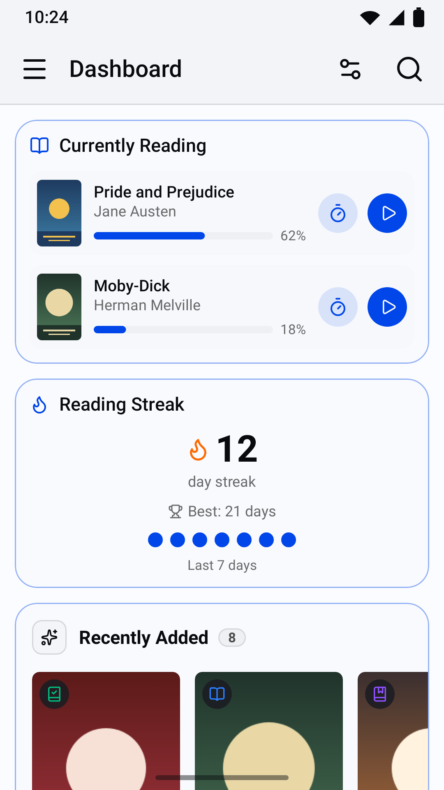
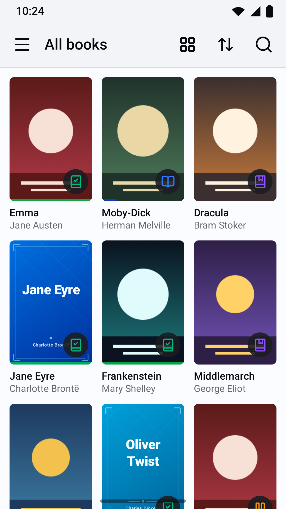
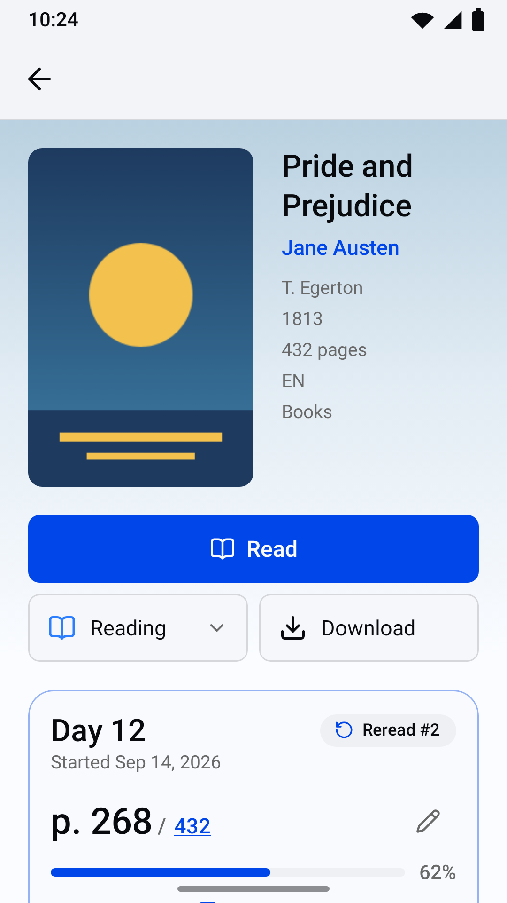
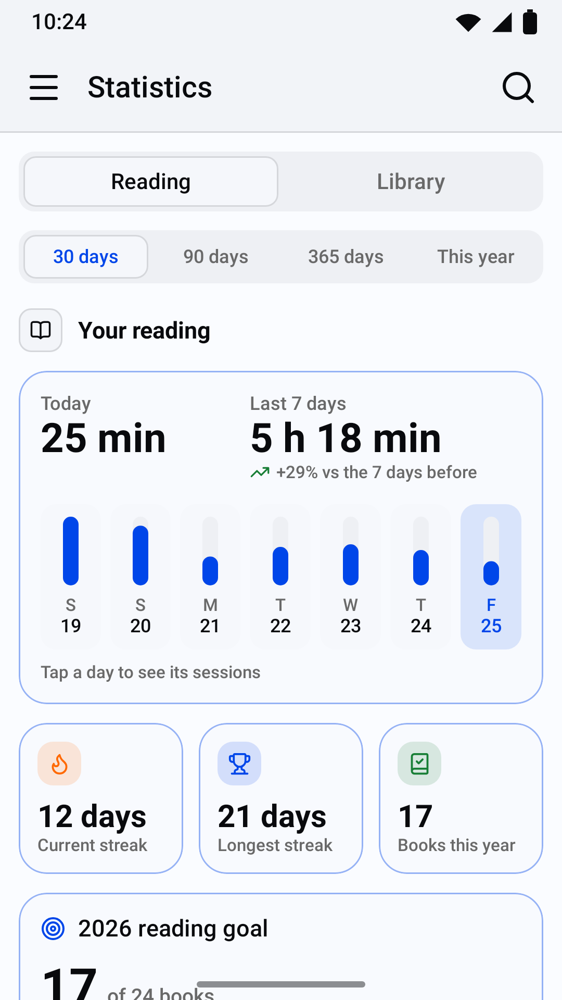
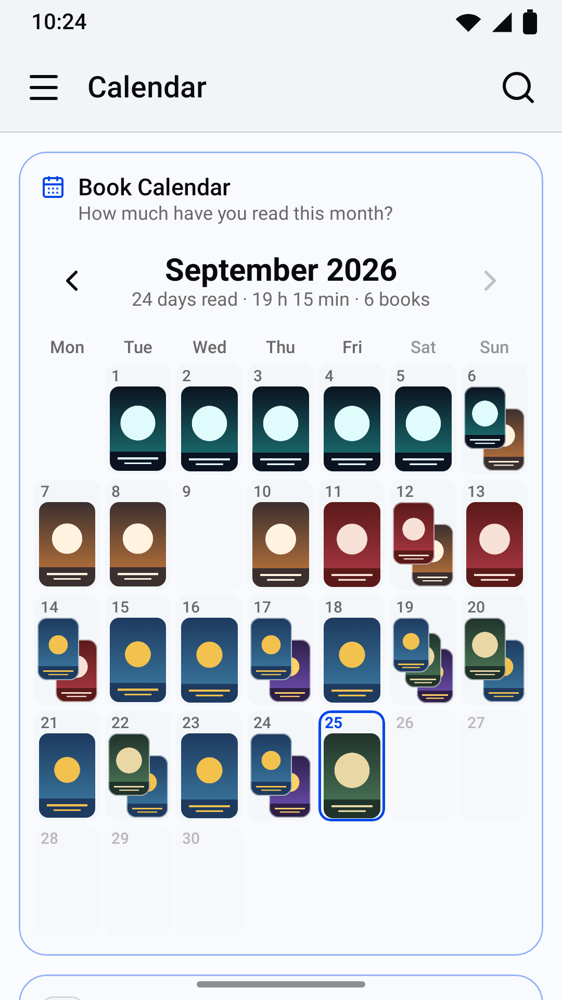
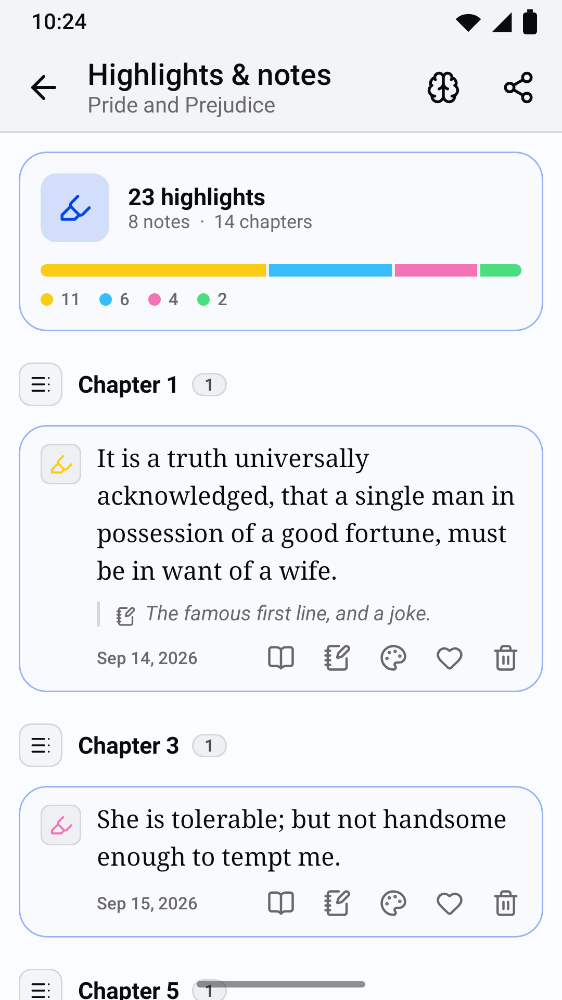

# Ottershelf

Ottershelf is an open-source Android app for reading, tracking and annotating the books on a
self-hosted [BookOrbit](https://github.com/bookorbit/bookorbit) server. It opens EPUB and the other
ebook formats, PDFs and comics from your server, keeps books on the phone for offline reading,
syncs your reading position and sessions back to the server, and brings BookOrbit's dashboard,
statistics, highlights and achievements to a native Kotlin and Jetpack Compose interface. It
requires your own BookOrbit server (or an account on one); it contains no server, no store and no
books of its own.

Ottershelf is a modified version of BookOrbit and is not an official BookOrbit release. It is not
affiliated with, approved, sponsored or endorsed by the BookOrbit project.

## Screenshots

| | | |
|---|---|---|
|  |  |  |
|  |  |  |

<!-- The six screenshots are rendered by StoreScreenshotTest in the app's repository (Roborazzi, 1080x1920). -->

## Features

### Reading

- **Ebooks** (EPUB, KEPUB, MOBI, AZW3, AZW, FB2) in a reader built on foliate-js: pages or
  continuous scrolling, page-turn animation, text size, line spacing, margins, the book's own font
  or a serif or sans-serif one, justification, hyphenation, page colours (the app's theme,
  original, sepia, dark, black or a custom colour), table of contents and full-text search.
- **PDF**: continuous or single-page layout, fit to width or page, night mode (inverted colours),
  outline, search and password-protected files, with per-book or default settings.
- **Comics** (CBZ, CBR, CB7): paged, infinite or gapless vertical scrolling (for webtoons),
  left-to-right or right-to-left, two-page spreads, fit modes and pinch zoom, and the next issue
  of a series at the end.
- **Highlights, notes and bookmarks** in the ebook reader: ten colours and four highlight styles,
  a note on any highlight, bookmarks, and a sheet listing them by chapter.
- **Look up** a selected word or phrase in Wiktionary and Wikipedia, or hand it to a dictionary or
  translation app installed on the phone.
- **Offline reading**: download any book (except CBR and CB7 comics, which the server unpacks page
  by page) and read it without a connection. Downloads continue in the background with a progress
  notification.
- **Progress sync**: your position and reading sessions are sent to your server, queued while you
  are offline and sent when the connection returns. If another device moved on in the meantime,
  you choose which position to continue from.

### Library

- **Dashboard** with BookOrbit's widgets (Currently Reading, Reading Streak, Reading Goal, Reading
  Rhythm, Library Overview and others) and shelves (Continue Reading, Want to Read, Up Next in
  Series, Discover Something New, Recently Added, Smart Scope shelves), which you can show, hide
  and reorder.
- **All books, libraries, smart scopes, collections, authors and series**, with search, sorting
  (title, author, series, date added, last read, published, read status) and filters (reading
  only, hide read, hide unread), remembered per list.
- **Grid or list views**; pinch the grid to change how many covers fit in a row; long-press a book
  for a quick view.
- **Book pages** with details, files and formats, read status, your rating, a private review,
  reading log and downloads.
- **Next in series**: when you finish a book, the next unread volume is suggested (can be turned
  off).
- **ISBN scanning**: scan the barcode of a paper book to find your library's copy, or see what
  metadata providers know about it and request it.
- **Book requests**: search your server's metadata providers, request a book and follow your
  requests (for accounts with request access).
- **Metadata editing**: change a book's title, authors, series and number, and its cover (a photo,
  an image from the Photo Picker, or a cover found online through your server), for accounts with
  the permission to edit metadata.

### Tracking

- **Reading timer**: count up or count down, with a notification to pause, resume or stop it that
  returns after a restart; save the session with the page you reached.
- **Reading log**: log sessions by hand, move or delete them, record past reads and rereads with
  their start and finish dates.
- **Calendar** of the books you read each day (a month can be saved as an image), **history** of
  every reading, **statistics** (reading and library charts), **reading goals** (daily minutes and
  books per year), **achievements** and a **year in review**.
- **Highlights and notes** across all books: filter by book, colour, notes or liked, a random
  note, a memorize mode, export as Markdown, and share a highlight as an image card.
- **Quotes**: type a quote from a paper book, or photograph the page and pick the lines to keep
  (text recognition runs on the phone, English only).

### Appearance

- Light, dark or system theme, accent colours, corner radius, surface opacity, dark-mode
  brightness and background patterns, kept on the device or synced with your BookOrbit account.

## Requirements

- An Android phone running **Android 12 or later** (API level 31).
- A **BookOrbit server** reachable over **HTTPS** with a certificate trusted by Android's system
  certificate store, and an account on it. Plain `http://` addresses are refused, and certificates
  from user-installed certificate authorities are not trusted.
- Ottershelf talks to BookOrbit's REST API (`/api/v1`). It was built and tested against the
  BookOrbit source of 23 September 2026 (upstream commit `1dd29c7`) [BookOrbit release version].
  Older servers may lack routes it uses; newer ones may change them.
- Some features depend on your account's permissions on the server: book requests need request
  access, and metadata editing and ratings need the permission to edit metadata.

## Install

- **Google Play** (testing): [Google Play testing link]
- **GitHub releases**: signed APKs are attached to each release at
  <https://github.com/redmundmcmund/ottershelf/releases>. The release signing certificate's
  SHA-256 fingerprint is
  `99:3B:5B:6A:81:9E:7E:22:A3:60:C9:96:CD:1F:D8:BA:93:9E:5C:BF:63:EA:A9:B6:F4:EF:9A:8F:0F:68:54:D6`.

The Play and GitHub builds use the same package ID (`io.github.ottershelf`) and the same signing
key: the project's own key is also the app signing key on Google Play (Play App Signing with an
uploaded key), so either build can update the other without reinstalling.

## Building from source

You need JDK 21 and the Android SDK (compile SDK 37). The Gradle wrapper downloads the matching
Gradle version.

```bash
./gradlew assembleDebug          # debug APK: app/build/outputs/apk/debug/
./gradlew bundleRelease          # release App Bundle: app/build/outputs/bundle/release/
./gradlew assembleRelease        # release APK (unsigned unless a signing key is configured)
./gradlew testDebugUnitTest      # JVM and Robolectric unit tests
./gradlew verifyRoborazziDebug   # screenshot tests against recorded images
./gradlew recordRoborazziDebug   # record the screenshot images again
```

On Windows, use `gradlew.bat` in place of `./gradlew`.

**Signing.** The repository contains no keys, passwords or other secrets. A release build is
signed only when a properties file outside the repository provides the key: the file named by the
Gradle property `ottershelf.keystore` (for example `-Pottershelf.keystore=/path/to/keystore.properties`),
or else `~/.ottershelf/keystore.properties`. It holds four values:

```properties
storeFile=release.jks        # relative to this file's folder, or an absolute path
storePassword=...
keyAlias=...
keyPassword=...
```

Without the file, or with a value missing (a build warning names it), `assembleRelease` produces
an unsigned APK and everything else, including the debug build and the tests, works as usual.
`.gitignore` excludes `*.jks`, `*.keystore`, `*.p12` and `keystore.properties`.

## Project structure

| Path | Contents |
|---|---|
| `app/src/main/java/.../core/` | Data layer: API client and models, session and token encryption, sync, downloads, tracking, settings, theme preferences |
| `app/src/main/java/.../ui/` | Navigation shell, theme, icons and shared Compose components |
| `app/src/main/java/.../feature/` | One package per feature: `login`, `home`, `library`, `book`, `reader`, `pdf`, `comics`, `downloads`, `notes`, `quotes`, `scan`, `requests`, `bookedit`, `seriesnext`, `timer`, `calendar`, `history`, `stats`, `achievements`, `settings` |
| `app/src/main/assets/foliate/` | foliate-js (from BookOrbit's copy, modified) and its vendored libraries |
| `app/src/main/assets/reader/` | The ebook reader's page and its bridge to the app |
| `app/src/test/` | Unit, Robolectric and Roborazzi screenshot tests |
| `app/src/androidTest/` | On-device tests (see [CONTRIBUTING.md](CONTRIBUTING.md)) |
| `tools/` | Icon generation, device-test runner, reader script tests |
| `docs/brand/` | Artwork and icon sources |
| `fastlane/metadata/` | Store listing texts and images |
| `docs/play/` | Google Play Console drafts |

[ARCHITECTURE.md](ARCHITECTURE.md) describes the packages, patterns and conventions in detail.

## Privacy

Ottershelf has no analytics, advertising, crash reporting or tracking of any kind, and contains no
third-party SDK that collects data. It connects only to the server address you type and, only when
you tap Look up on selected text, to Wiktionary and Wikipedia, through a separate connection that
never carries your account's token. The camera is used only when you choose to scan an ISBN,
photograph a page for a quote or take a cover photo; images are processed on the phone, and a
cover photo is sent only to your own server, only when you confirm it. Sign-in tokens are
encrypted with an Android Keystore key, and the app's data is excluded from backups. See
[PRIVACY.md](PRIVACY.md) for the full privacy policy.

## Licence and attribution

Ottershelf is free software: you can redistribute it and/or modify it under the terms of the
[GNU Affero General Public License, version 3 only](LICENSE) (`AGPL-3.0-only`), together with
BookOrbit's [additional terms](ADDITIONAL_TERMS.md), as permitted by section 7 of that licence. It
is distributed without any warranty. Copyright notices and the list of modifications are in
[NOTICE](NOTICE).

Ottershelf contains material from BookOrbit (its copy of foliate-js, and code ported from its web
client and API types). As BookOrbit's additional terms require:

- The app shows BookOrbit's attribution under **Settings > About Ottershelf**, with
  **Powered by BookOrbit** linking to <https://github.com/bookorbit/bookorbit>.
- This is a modified version of BookOrbit and is not an official BookOrbit release. The About
  screen shows the modification date and links to the complete source of the installed version.
- "BookOrbit" is used only to state the server the app works with and in the required attribution;
  it is not the app's name or branding.

## Third-party components

Ottershelf is built with open-source components that keep their own licences, including
foliate-js, zip.js, fflate, Lucide icons, Jetpack Compose and AndroidX, CameraX, OkHttp, Coil,
Telephoto, zxing-cpp and Tesseract. See [THIRD_PARTY_NOTICES.md](THIRD_PARTY_NOTICES.md).

## Contributing

Bug reports, feature requests and pull requests are welcome. See [CONTRIBUTING.md](CONTRIBUTING.md),
the [code of conduct](CODE_OF_CONDUCT.md), and [SECURITY.md](SECURITY.md) for reporting
vulnerabilities.
